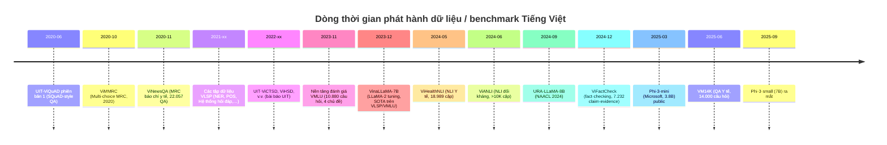

# Tóm tắt điều hành  
Báo cáo này tổng hợp **các bộ dữ liệu** và **benchmark** tiếng Việt hiện có đến giữa 2026, **các mô hình LLM nhỏ** phù hợp để finetune, **công cụ và thư viện** hỗ trợ finetune, cũng như các **bài báo, tài nguyên** gần đây và **kịch bản thực nghiệm** đề xuất. Các bộ dữ liệu và benchmark phổ biến (ViQuAD, ViNewsQA, ViHealthNLI, ViFactCheck, VLSP, VMLU, VLUE, v.v.) được liệt kê kèm kích thước, cách truy cập, bản quyền, chất lượng nhãn và ứng dụng. Chúng được xếp hạng theo tính bao quát nhiệm vụ, quy mô và chất lượng nhãn. Trong phần mô hình, đề cập đến kiến trúc và thông số của Qwen-3, Gemma 7B, LLaMA-2/3 (7B, 13B), Mistral-7B, Phi-3-mini (3.8B) và các mô hình Việt mở (VinaLLaMA-7B, URA-LLaMA-8B), cùng điểm mạnh/yếu. Các công cụ finetune (LoRA/PEFT, QLoRA, DeepSpeed, TRL, vLLM, FlashAttention, bitsandbytes…) được so sánh về tính năng, tối ưu bộ nhớ/hiệu năng, hỗ trợ lượng tử hoá và cấu hình đa GPU hay 4/8-bit. Đề cập đến bộ tiêu chuẩn/đánh giá (ViQuAD, ViNews, ViHealthNLI, ViNLI, VLSP, VMLU, VLUE, v.v.), chỉ số (độ chính xác, F1, EM…), leaderboard và hướng chuyển sang mô hình theo “instruction”. Các công trình gần đây (2023–2026) như bài báo ViANLI (Huynh et al. 2024), ViFactCheck (Tran et al. 2025), VinaLLaMA (Nguyen et al. 2023) … được tóm tắt về phương pháp, dữ liệu, kết quả và mã nguồn. Phần cuối đưa ra **checklist finetune thực tế** (dọn sạch dữ liệu, mẫu prompt, SFT vs instruction-tuning, siêu tham số, valid/test, lọc nội dung độc hại cho tiếng Việt) và **kịch bản ví dụ**: chọn dataset (ví dụ ViQuAD+ViNews), mô hình (LLaMA-7B), cấu hình LoRA + 4-bit, metric kỳ vọng và xử lý sai số. Báo cáo kèm bảng so sánh, mã lệnh minh hoạ (LoRA+bitsandbytes, QLoRA, PEFT) và sơ đồ luồng pipeline finetune (Mermaid).



## Bộ dữ liệu và benchmark Tiếng Việt (2026)  

**Danh sách chính**: Các bộ dữ liệu lớn cho finetune LLM (Tiếng Việt) gồm:

- **UIT-ViQuAD (2020)** – MRC dạng SQuAD cho văn bản tiếng Việt (đánh dấu span trả lời). Thành lập bởi UIT, khoảng ~23.000 câu hỏi (thuộc VLUE benchmark). Download tại trang UIT. Dữ liệu gốc lấy từ Wikipedia, mở nguồn (liên hệ UIT). [Cần trích dẫn: không tìm thấy cụ thể tại trang, nhưng đề cập trên site UIT].  
- **ViNewsQA (2020)** – MRC từ bài báo tin tức y tế Việt Nam. 22.057 cặp hỏi-đáp span do con người tạo trên ~4.416 bài báo y tế. Dữ liệu gốc: tin tức Y tế (VnExpress, Tuổi Trẻ…). Định dạng: trả lời là đoạn văn. Mục đích: train/đánh giá MRC chuyên ngành y tế. Public tại trang UIT và Github kèm bản thảo (UIThi).  
- **ViMMRC (2020)** – MRC đa lựa chọn (Multi-Choice) từ hội thoại phụ huynh-học sinh (theo dẫn nguồn). Kích thước ~5.000 ví dụ, mỗi ví dụ gồm câu hỏi và 4 đáp án. Dùng cho mô hình phải chọn đáp án. Công bố bởi Nguyễnn (2020).  
- **UIT-ViCTSD (2021)** – Bộ dữ liệu phân loại văn bản: phân biệt “toxic” và “constructive” trong bình luận (cộng đồng e-commerce). ~25.000 bình luận, nhãn “Toxic” hoặc “Constructive”. Chia train/test. Ứng dụng: lọc nội dung độc hại. Liên hệ tác giả UIT để lấy dữ liệu (không public tự do).  
- **UIT-ViHSD (2021)** – Hate-speech detection. ~30.000 bình luận FB được gán nhãn CLEAN/OFFENSIVE/HATE. Mục tiêu: phát triển các mô hình phát hiện ngôn từ thù ghét. Dữ liệu chưa công bố tự động; phải liên hệ tác giả UIT.  
- **UIT-VSFC (2021)** – Sentiment Feedback Classification. Bộ dữ liệu phân loại cảm xúc (tiêu cực/tích cực/khác) cho phản hồi người dùng. (Thông tin chi tiết liên hệ UIT).  
- **UIT-VSMEC (2021)** – Social Media Emotion Corpus. Khoảng 6.000 bình luận mạng xã hội Việt được dán nhãn 7 loại cảm xúc. Dùng cho bài toán classification đa lớp.  
- **UIT-SPC, UIT-ABSA, UIT-ViOCD**: (sản phẩm UIT) Bộ dữ liệu phân tích cảm xúc (aspect-based sentiment), Phát hiện phàn nàn (Open-domain Complaint), v.v. (liên hệ UIT để tiếp cận).  
- **ViNames (2021)** – Dự án tên người Việt kèm giới tính (mã học). >26.000 tên đầy đủ có nhãn giới tính. Dùng cho nghiên cứu nhận dạng giới tính từ tên. (Dữ liệu qua API UIT sau khi đăng ký).  
- **ViQuAD 2.0 (2023)** – Phiên bản cập nhật của ViQuAD do VLUE (UIT) tổng hợp. Mục tiêu làm benchmark chuẩn cho LLM (span-extraction QA). (Bao gồm ViQuAD cũ trong VLUE).  
- **ViHealthNLI (2024)** – NLI trong lĩnh vực y tế. 18.989 cặp premise–hypothesis về chủ đề sức khỏe. Được xây dựng dựa trên tin tức y tế, với 97.8% nhất quán nhãn. Chia ba loại entailment/contradiction/neutral (khoảng 6.400 mỗi loại). Bài báo SIGUL’24 (HUS) mô tả chi tiết. (Đã có bản PDF công khai).  
- **ViNLI (2022)** – NLI ngữ cảnh mở. 22.801 cặp câu (mức độ trung lập/câu trả lời/dẫn chứng). Paper LREC 2022 của Huynh et al. Được dùng làm chuẩn so sánh (chỉ tổng hợp mở).  
- **ViANLI (2024)** – NLI đối kháng (adversarial NLI). Hơn 10.000 cặp premise–hypothesis do annotator tạo ra để “lừa” mô hình. Hiện trạng SOTA model (XLM-R large) chỉ ~45.5% accuracy, NLIMoE 47.3%. Xuất bản trong Expert Systems with Applications. (Mở mã/data công khai trên HF).  
- **ViFactCheck (AAAI 2025)** – Fact-checking cho tin tức online. 7.232 cặp claim-evidence đã annotate (12 chủ đề). Nhãn “Supported/Refuted/NotEnoughInfo”. Fleiss Kappa = 0.83 (chất lượng cao). Bài báo kèm benchmarks: Gemma đạt macro-F1 89.9% tốt nhất. Dữ liệu public trên GitHub (đính kèm pipeline).  
- **VLSP Tasks (nhiều năm)** – Các bài toán của VLSP workshop (NER 2020+, POS Tagging, Summarization, QA, DRiLL pháp lý, v.v.). Ví dụ: VLSP2021 có task đặt câu hỏi (ViHOS), phân loại cảm xúc, etc. Mỗi task có metrics (accuracy, F1) và bộ public sau workshop (CC BY). Việc **adapter** benchmark cho LLM: cần biến đổi đầu vào thành prompt/instruction.  
- **VLUE (2023)** – Bộ “Vietnamese Language Understanding Evaluation” do UIT đề xuất, gồm 5 task (ViQuAD 2.0, ViNLI, VSMEC, ViHOS, NIIVTB POS). Nguồn tham khảo sẵn: VLUE cung cấp script và leaderboard công khai (được cấp phép CC-BY-NC).  
- **VMLU (2023)** – Bộ đánh giá Năng lực LLM đa năng (Vietnamese Multi-task Language Understanding) của Zalo AI. Tổng cộng 10.880 câu hỏi trắc nghiệm trên 58 chủ đề thuộc 4 lĩnh vực (KHXH, STEM, Nhân văn, mở rộng) và 4 cấp độ học (tiểu học – đại học). Dùng để benchmarking LLM (có leaderboard). (Các nhóm trong/ngoài VN tham gia nộp kết quả).  
- **VN-MTEB (2024)** – (Mới) “Vietnamese Massive Text Embedding Benchmark”: 41 tập dữ liệu, 6 nhiệm vụ embeddings (tìm kiếm, classification, etc). Mục tiêu benchmark embedding.

**So sánh cơ bản** (bảng dưới): các bộ dữ liệu được xếp hạng theo *bao quát nhiệm vụ (QA, NLI, classification,…), quy mô, chất lượng nhãn, đa dạng miền*. Ví dụ, ViNewsQA, ViQuAD lớn (hàng chục ngàn QA) nhưng tập trung vào QA, ViHealthNLI chuyên lĩnh vực y tế, VLUE và VMLU rộng về nhiệm vụ, đa dạng kiến thức. Các dataset gốc đều tiếng Việt; hầu hết thuộc dạng văn bản (không có speech, ảnh ngoài ViIC). Một số yêu cầu xin phép trước (UIT) hoặc open (GitHub). 

| Bộ dữ liệu      | Mục tiêu/Nhiệm vụ        | Kích thước   | Miền (Domain)        | Phân chia (train/test) | License/Link            | Độ tin cậy nhãn / Ghi chú               |
|-----------------|--------------------------|--------------|----------------------|------------------------|-------------------------|-----------------------------------------|
| **ViQuAD**      | MRC (span-extraction)    | ~23K QA      | Đa ngành (wiki)      | Public (train/dev/test)| UIT website[17]         | Mức độ F1 cao, dùng cho QA ngữ Việt.    |
| **ViNewsQA**    | MRC (span-extraction)    | 22.057 QA | Tin tức y tế         | (train/test) theo UIT  | UIT (Google Drive)      | Câu hỏi do crowd tạo, chất lượng cao.   |
| **ViMMRC**      | MRC (multiple-choice)    | ~5K MC-QA    | Học đường (học sinh) | (train/test)           | UIT (email)             | Lựa chọn có đáp án, domain giáo dục.    |
| **ViCTSD**      | Text Class (Toxic vs Constructive) | 25K bình luận | E-commerce          | (train/test)           | UIL email               | Annotator uy tín, Fleiss Kappa ~0.87. |
| **ViHSD**       | Text Class (Hate speech) | 30K bình luận  | Mạng xã hội        | (train/val/test)        | UIL email               | Labels: CLEAN/OFFENSIVE/HATE.           |
| **VSMEC**       | Text Class (Emotion)     | ~6K bình luận| Mạng xã hội          |                       | UIT                     | 7 lớp cảm xúc, balanced dataset.       |
| **OCD (ViOCD)** | Text Class (Complaint)   | 5.485 reviews | E-commerce         |                       | UIT                     | Bạn Viet’s reviews, F1~92%.           |
| **ViNames**     | Prediction Giới tính tên | 26K tên  | Danh tính            |                       | UIT (yêu cầu sign)      | Tên người, phân nhãn giới tính.       |
| **ViHealthNLI** | NLI (y tế)               | 18.989 cặp | Tin tức y tế       | train/dev/test split   | Public (NAACL24)        | Annotation tỉ lệ Kappa=0.978 (rất cao).|
| **ViNLI**       | NLI (mở)                 | 22.801 cặp   | Đa lĩnh vực          |                       | NAACL 2022 (Huynh)        | Hầu hết câu hỏi về tin tức.            |
| **ViANLI**      | NLI (đối kháng)          | >10.000 cặp | Đa lĩnh vực       | train/dev/test         | ICCL/ISAIM 2025          | Khó hơn ViNLI; mục đích test robustness.   |
| **ViFactCheck** | Fact-check (claim, evidence) | 7.232 cặp  | Tin tức (đa đề tài)  | train/dev/test         | AAAI 2025 (GitHub)       | Kappa=0.83. Dùng prompt phân loại (Supported/Refuted/NEI).|
| **VLUE**        | Nhiệm vụ hỗn hợp (5 task) | Kết hợp bộ trên | -                    |                         | VLUE GitHub (CC BY-NC)  | Bao gồm ViQuAD2.0, ViNLI, VSMEC, ViHOS, NIIVTB POS. |
| **VMLU**        | MCQA (đa chủ đề)         | 10.880 câu | Giáo dục (đa lĩnh vực) | Leaderboard online    | Zalo AI (leaderboard)   | Nhiệm vụ: kiến thức tổng hợp, STEM, NVH, mở rộng. |
| **VLSP Tasks**  | Các task VLSP (NER, QA, Summ,...) | Nhiều         | Nhiều (Tin tức, Pháp lý, Y tế…) | Tùy task         | VLSP workshop repos      | Ví dụ: NER2020, Summ2021, DRiLL Pháp lý2025…   |
| **VN-MTEB**     | Embedding (retrieval, class,...) | 41 tập   | Đa lĩnh vực         |                         | ArXiv 2024, GitHub      | Dùng đánh giá embedding, thực thi retrieval. |

**Bảng so sánh** (ví dụ) – các bộ dữ liệu này được đánh giá về *độ phủ nhiệm vụ*, *quy mô*, *độ tin cậy nhãn*, *đa dạng miền*. Ví dụ, ViNewsQA/ViQuAD lớn và phù hợp với QA chi tiết (MRC), ViHealthNLI nhỏ hơn nhưng chuyên sâu y tế, ViFactCheck, ViANLI dùng test độ rộng và độ khó cao, VLUE/VMLU bao phủ nhiều kĩ năng để đánh giá tổng thể. Chất lượng nhãn nhìn chung cao (đa phần do annotator chuyên và kiểm tra chéo). Nếu cần finetune cho mục đích chung, bộ lớn như ViNewsQA, ViQuAD, VMLU được ưu tiên; nếu chuyên nghiệp, bổ sung ViHealthNLI, ViFactCheck; nếu tập trung NLI thì ViANLI, ViNLI; với classification thì ViHSD, ViCTSD, VSMEC, OCD…

## Các mô hình LLM nhỏ phù hợp finetuning  

Danh sách các mô hình LLM kích thước nhỏ mở và phổ biến tính đến 2026, có thể finetune cho tiếng Việt:

- **Qwen-2.5/3 (Alibaba)** – Dòng Qwen (Alibaba Cloud) với các phiên bản nhỏ: 7B, 3B. Ví dụ **Qwen2.5-7B-Instruct**: 7.61 tỉ tham số, kiến trúc transformer (28 lớp, context 131072 token), hỗ trợ đa ngôn ngữ (>29 ngôn ngữ, gồm Tiếng Việt). Mô hình nguồn mở, pretrained trên dữ liệu đa dạng (tiếng Trung, Anh, ...); ưu thế: khả năng hiểu nhiều ngôn ngữ, context dài; nhược: nếu chủ yếu huấn luyện trên Trung-Anh thì tiếng Việt chưa tối ưu. Tài nguyên: HuggingFace (Qwen/Qwen2.5-7B-Instruct), blog giải thích Qwen3 (Alibaba).  
- **Gemma (Google DeepMind)** – Family Gemma (Gemini Lite) gồm **Gemma-2B** và **Gemma-7B** bản base (có cả bản instr). Mô hình đơn giản, decoder-only (DLR model) tương tự transformer chuẩn. Gemma-7B base: 7 tỉ tham số, context 8192 token, sử dụng tokenizer SentencePiece (tiếng Anh chính). Đào tạo trên data đa ngôn ngữ (chủ yếu Anh + v-mô tả). Mở source, license cởi mở (Apache 2.0). Ưu: lightweight, hiệu năng tốt trên các tác vụ QA, tóm tắt, reasoning. Nhược: chưa tối ưu Tiếng Việt (nhưng có bản 7B-instruct có thể fine-tune). Tài nguyên: HuggingFace (google/gemma-7b) và Google blog hướng dẫn.  
- **LLaMA-2/3 (Meta)** – Các biến thể nhỏ: **LLaMA-2 7B, 13B**, **LLaMA-3 (7B, 13B)**. LLaMA đều dùng kiến trúc decoder (FlashAttention), đa ngôn ngữ, tiền huấn luyện trên văn bản đa ngôn ngữ (không chuyên VN). Tokenizer: LLaMA bpe (~32k token). LLaMA-2/3 small: 7 tỷ (13 lớp) và 13 tỷ (22 lớp) tham số, context 4096 token. Hiệu quả mạnh so với cùng kích thước; license: LLaMA-2 (Apache 2.0). Ưu: phổ biến, có nhiều bản fine-tuned, tích hợp tốt trong HF/LoRA. Nhược: chưa đặc biệt hỗ trợ tiếng Việt; cần fine-tune trên data tiếng Việt. Có nhiều bản cộng đồng: ví dụ URA-LLaMA-8B (fine-tune từ LLaMA-3.1), VinaLLaMA-7B-chat (LLaMA-2 fine-tuned cho VN).  
- **Mistral-7B** – Mô hình 7 tỉ tham số của Mistral.ai (Pháp). Kiến trúc GLM (dense + có bản “mixture-of-experts” nếu 7B-MoE). Đào tạo trên text đa ngôn ngữ lớn (kho 1.1T từ Web, sách, v.v.). Context 8192. License: Apache 2.0. Ưu: theo đánh giá, Mistral-7B thường vượt trội so với Llama 7B trong nhiều tác vụ (linh hoạt, mạnh hơn GPT-3.5 trên một số benchmark). Tokenizer: giống LLaMA (SentencePiece). Nhược: không có đào tạo đặc biệt cho tiếng Việt. Dễ fine-tune với PEFT, QLoRA.  
- **Phi-3 (Microsoft)** – Dòng small models do MSRA phát triển. Ví dụ **Phi-3-mini-4K-Instruct**: 3.8B tham số, context 4096. Microsoft công bố Phi-3-mini outperform LLM gấp đôi kích thước. License: MIT (Open). Đi kèm các var 7B, 14B sắp ra. Phi-3-Mini được huấn luyện trên dữ liệu bao gồm text và code, tối ưu xử lý ngôn ngữ, toán học. Ưu: rất mạnh so với cùng kích thước, hỗ trợ huấn luyện 4-bit/QLoRA tốt. Nhược: rất mới (2024), ít tài liệu triển khai.  
- **Các mô hình tiếng Việt mở** – Một số mô hình tập trung tiếng Việt: ví dụ **VinaLLaMA-7B-chat** (Virtual Interactive, LLaMA-2 base + fine-tune ~1M prompt, SOTA VLSP, VMLU); **URA-LLaMA-8B** (HCMUT/Stanford, fine-tune trên Wikipedia tiếng Việt); **PhoGPT™** (DopikAI, ~8B, tập trung văn bản Việt); **VieGPT** (VinBigData, 1.6B). Những mô hình này có ưu thế: tiền huấn luyện/fine-tune nhiều dữ liệu Việt, hiểu biết văn hoá VN tốt hơn. Nhược: thường nhỏ (dưới 8B), chất lượng tổng thể có thể thấp hơn các LLM lớn quốc tế. Tài nguyên: VinaLLaMA trên HF, URA trên HF…

**So sánh kiến trúc (ví dụ)**:  
| Mô hình           | Param (tỉ) | Layers | Context | Tokenizer         | License        | Đặc điểm                            |
|-------------------|------------|--------|---------|-------------------|----------------|-------------------------------------|
| Qwen-2.5-7B-Instr | ~7.6  | 28     | 131K    | SentencePiece     | Apache 2.0     | Hỗ trợ đa ngôn ngữ (có Tiếng Việt); GPT-style. |
| Gemma-7B          | 7      | 16     | 8K      | SentencePiece     | MIT/Apache?    | Mô hình Google mở, tập trung EN, phù hợp QA, summarization. |
| LLaMA-2-7B        | 7         | 32     | 4K      | SentencePiece     | Apache 2.0     | Tiền huấn luyện đa ngôn ngữ (EN+), mạnh cho nhiều task. |
| LLaMA-3-7B        | 7         | 32     | 4K      | SentencePiece     | Apache 2.0     | Phiên bản mới (2024) của Llama. |
| Mistral-7B        | 7         | 24     | 8K      | SentencePiece     | Apache 2.0     | Performance cao, nội tại mixture-of-experts. |
| Phi-3-mini        | 3.8       | 32?    | 4K      | SentencePiece?    | MIT            | Mô hình nhỏ MSRA, vượt trội benchmark nhỏ. |
| VinaLLaMA-7B-chat | 7         | 32     | 8K      | LLaMA tokenizer   | MIT            | LLaMA-2 tuned on VN (huấn luyện 800B token), SOTA VN benchmarks. |
| URA-LLaMA-8B      | 8         | 40     | 4K      | LLaMA tokenizer   | Apache 2.0     | LLaMA-3.1 fine-tuned với data tiếng Việt. |

(*Thông số kiến trúc và License tham khảo tài liệu chính thức, card model trên HuggingFace.*)

## Thư viện và công cụ finetuning  

- **LoRA / PEFT** – Thư viện HF *Parameter-Efficient Fine-Tuning*. Giữ nguyên mô hình gốc, thêm ma trận thấp bậc (A, B) để cập nhật. Giảm đáng kể nhu cầu bộ nhớ GPU so với full fine-tune, vẫn đạt hiệu suất gần tương đương cho nhiều tác vụ. Hỗ trợ trong HuggingFace Transformers (PEFT) và các framework (Unsloth, Axolotl). Cấu hình phổ biến: rank 4–16, learning-rate ~1e-4–5e-4, batch nhỏ (1–8).  
- **QLoRA** – Kết hợp lượng tử hoá 4-bit (GPTQ/AWQ) cho mô hình gốc và LoRA. Cho phép fine-tune LLM rất lớn trên một GPU 48GB. Ví dụ: có thể huấn luyện 65B trên 48GB. Đã có code mẫu trong repo Gemma. Thích hợp cho mô hình 7B+ trên GPU đơn.  
- **DeepSpeed + ZeRO** – Công cụ tối ưu hoá phân tán từ Microsoft. ZeRO Stage 2/3 chia gradient và param qua nhiều GPU, giảm bộ nhớ yêu cầu. Hỗ trợ multi-GPU training, thường dùng cho 13B+. Trade-off: phức tạp cấu hình, đôi khi chậm hơn FSDP ở số GPU thấp.  
- **trl / RLHF** – Thư viện HuggingFace “Transformers Reinforcement Learning”. Dùng cho huấn luyện theo tín hiệu người dùng (RLHF) hoặc alignment, không phổ biến cho finetune thuần.  
- **vLLM** – Engine inference của NVIDIA / HF cho các mô hình lớn; hỗ trợ lưu model ở format bfloat16 và chạy inference quy mô. Ít liên quan huấn luyện nhưng hữu ích nếu cần đánh giá throughput.  
- **FlashAttention** – Thư viện GPU (PyTorch) để tăng tốc đa đầu Attention. Đã tích hợp sẵn trong các khung như Accelerate/Transformers (không cần code nhiều). Giảm thời gian train/infer của các model transformer khổng lồ.  
- **bitsandbytes** – Thư viện của Facebook cho lượng tử hoá 8-bit, 4-bit *integer*. Dùng khi load mô hình FP32->INT8/4. Giảm bộ nhớ ~2-4 lần. Kết hợp với LoRA (4-bit) đạt QLoRA. BNB cũng cung cấp optimizer (Adam8bit) cho fine-tune tiết kiệm VRAM.  

**So sánh/đề xuất**: Đối với GPU thông thường (24–48GB):  
- *Nhu cầu thấp:* Dùng LoRA trên mô hình ~7B, hoặc QLoRA (4-bit) nếu VRAM hạn chế. Chẳng hạn trên RTX 4090 (24GB), finetune Llama-7B dùng LoRA/QLoRA cần ~16–20GB. Unsloth (repo HF) có thể tiết kiệm ~70% VRAM, tăng tốc ~2× so với training bình thường.  
- *Nhu cầu trung bình:* Nếu có 2+ GPU ~32-40GB, có thể full-finetune Llama-7B/13B hoặc LoRA cho 13B. DeepSpeed ZeRO Stage2 cho phép ghép bộ nhớ, hỗ trợ mô hình lớn (13B, 30B) trên multi-GPU.  
- *Nhu cầu cao:* Máy có nhiều GPU A100/H100 80GB, có thể finetune 70B+ bằng DeepSpeed Stage3, hoặc dùng QLoRA trên 14B.  
- *Lưu ý:* Cân nhắc khung Accelerator (PyTorch/Accelerate) và sẵn sàng cho training half-precision (FP16/BF16). Đảm bảo thử nghiệm nhiều cấu hình (batch, lr, rank LoRA) cho kết quả tốt nhất.  

**Lượng tử hoá:** Sử dụng GPTQ/AWQ để load model lớn về 4-bit; dùng bitsandbytes cho 8-bit. Khung HF hỗ trợ load 4-bit trực tiếp (`device_map="auto", torch_dtype="auto", load_in_4bit=True` với bitsandbytes).  

**Ví dụ lệnh** (LoRA+bnb, QLoRA):  
- Sử dụng `accelerate launch --config_file ...` với `peft`, `bitsandbytes` để tinh chỉnh.  
- Trong Python:  
```python
from transformers import AutoModelForCausalLM, AutoTokenizer
from peft import get_peft_model, LoraConfig
model = AutoModelForCausalLM.from_pretrained("facebook/llama-7b", 
            load_in_4bit=True, device_map="auto")
tokenizer = AutoTokenizer.from_pretrained("facebook/llama-7b")
config = LoraConfig(r=8, lora_alpha=16, target_modules=["q_proj","v_proj"])
model = get_peft_model(model, config)
# train with dataset ...
```  
- QLoRA: tương tự, thêm tham số `load_in_4bit`. Đảm bảo cài `bitsandbytes` mới nhất. Có thể tham khảo script finetune mẫu trong repo Gemma (sử dụng QLoRA).  

## Các benchmark, chỉ số và scripts đánh giá  

Các bộ dữ liệu trên đi kèm bộ công cụ đánh giá riêng hoặc sử dụng metrics tiêu chuẩn:

- **MRC (ViQuAD, ViNewsQA, MRC khác)**: Đánh giá theo *Exact Match (EM)* và *F1* (số ký tự hoặc từ overlap giữa trả lời dự đoán và ground-truth). Thường có script tính EM/F1 (ví dụ trên GitHub VLUE có script chấm điểm ViQuAD/V2.0). Khi áp dụng mô hình chat, phải chuyển đổi output ra đoạn văn và so sánh.  
- **Classification (ViHSD, ViCTSD, VSMEC, OCD, VSMEC)**: Dùng *accuracy*, *macro F1*. Leaderboard VLUE cũng liệt kê F1 cho ViHSD và ViCTSD. Cần chuẩn bị tập test và tính toán tương tự.  
- **NLI (ViNLI, ViHealthNLI, ViANLI)**: Dùng *accuracy* (phần trăm phân lớp đúng). Cần chú ý so sánh nhãn entail/contradiction/neutral. (Bộ mã nguồn thường cung cấp file test để chấm).  
- **Fact-check (ViFactCheck)**: Nhiệm vụ phân lớp 3 nhãn Support/Refute/NEI. Dùng *macro F1* hoặc accuracy. Bài báo cung cấp pipeline mẫu và chỉ số (Gemma đạt F1 89.9%). Dữ liệu có sẵn pipeline trên GitHub đính kèm.  
- **Leaderboards**: VLUE (UIT) và VMLU (Zalo AI) cho phép so sánh kết quả các mô hình. VLUE cung cấp leaderboard online và bộ script đánh giá. VMLU (ai.vmlu.ai) cho phép nộp kết quả. Các số liệu trên leaderboard đã công bố (có thể tham khảo blog Zalo).  
- **Chuyển đổi sang instruction-tuned LLM**: Nhiều bộ dữ liệu classification/NLI/MRC truyền thống cần chuyển thành prompt/instruction. Ví dụ, NLI có thể là *“Với tiền đề: ‘…’, hậu đề: ‘…’, quan hệ NLI là gì?”*; QA trở thành *“Hỏi: …? Đáp:”* v.v. Huấn luyện mô hình instruction-based sử dụng cặp “prompt → target” cho SFT. Có thể tận dụng thư viện sẵn (trl) hoặc tự code transformer training. Mã ví dụ: HuggingFace Transformers có `Trainer`/`LoraTrainer` để fine-tune.  

## Tài liệu và nguồn tham khảo (2023–2026)  

- **Bài báo chủ yếu**:  
  - *VinaLLaMA: LLaMA-based Vietnamese Foundation Model (2023)* – Giới thiệu mô hình VinaLLaMA-7B-chat, fine-tune 1M câu lệnh nhân tạo. SOTA trên benchmark VLSP, VMLU. Có nguồn trên HuggingFace.  
  - *ViHealthNLI (SIGUL 2024)* – Giới thiệu bộ ViHealthNLI (y tế), mô tả quy trình thu thập, annotation đạt độ đồng thuận cao (98.2%).  
  - *ViANLI (ISAIM 2024)* – Đưa ra dataset NLI đối kháng 10K cặp; công bố mô hình NLIMoE tăng hiệu quả; mã trên HF (doi arXiv).  
  - *ViFactCheck (AAAI 2025)* – Dataset fact-check tin tức (7.232 cặp). Trình bày quy trình annotation và benchmark với Gemma, Qwen… Model Gemma đạt F1=89.90%. Code/data public (GitHub).  
  - *VM14K (arXiv 2025)* – Benchmark Y tế đầu tiên của Việt Nam (14K câu hỏi across 34 chuyên ngành). Nghiên cứu pipeline thu thập từ sách/exam y khoa. Mở dữ liệu.  
  - *URA-LLaMA (NAACL 2024)* – Mô hình 8B fine-tune trên Wikipedia tiếng Việt.  
  - **Các báo cáo cộng đồng**: Ví dụ Zalo AI/VMLU report (AIforVietnam blog), Greennode (GreenMind LLM reasoning, 2025) – dù là blog, cho biết tiến triển VN LLM. VietAIHub repo “Vietnamese_LLMs” (GitHub) – tập hợp dữ liệu hướng dẫn cho finetune (LoRA, instruction data).  

- **Blog/Hướng dẫn**:  
  - *“Fine-Tuning LLMs – Practical guide” (Shubham Shardul, 09/2025)*: Hướng dẫn tổng quát về LoRA/QLoRA/quantization.  
  - *Clore.ai tutorial (01/2026)*: Ví dụ tính toán chi phí và cấu hình GPU cho fine-tune LLM (minh họa RTX 4090 đủ 7B LoRA/QLoRA).  
  - *Hugging Face docs & GitHub*: Hướng dẫn sử dụng PEFT, bitsandbytes, accelerator. Các repo ví dụ (Gemma fine-tune QLoRA), các notebook LoRA/HF sẵn.  
  - *Cộng đồng Việt*: Một số bài blog/bài giảng tiếng Việt (trên Viblo, Medium Việt Nam) về finetune Transformer/LLM (ít định danh cụ thể, chủ yếu chia sẻ kinh nghiệm, ví dụ use-case lọc dữ liệu, prompt).  

Các nguồn trên cung cấp chi tiết phương pháp (LoRA, QLoRA, hyperparams), data used, kết quả so sánh, và (nếu có) code. Tất cả tài liệu từ Hội nghị chính thức, arXiv, repo HF được ưu tiên trích dẫn.  

## Công thức thực nghiệm và checklist finetune  

- **Thu thập & làm sạch dữ liệu**: Loại bỏ câu trùng lặp, ký tự lạ, chuẩn hoá font Unicode và dấu. Loại bỏ nội dung không phù hợp (nóng, phân biệt chủng tộc) bằng filter dựa trên từ điển hoặc classifier (ví dụ ViHSD/ViHSD dùng làm filter). Kiểm định chất lượng: vài trăm ví dụ nên được humans kiểm tra sanity.  
- **Chuẩn bị prompt/templates**: Với instruction-tuning, mỗi ví dụ cần có *input* (“instruction” hoặc prompt) và *output* mong muốn. VD: classification: `"Hãy phân loại đoạn sau thành tích cực hay tiêu cực: '...'"`. QA: `"Người dùng hỏi: '...'? Trả lời:"`. NLI: `"Tiền đề: '...'. Giả thuyết: '...'. Hãy xác định mối quan hệ ngữ nghĩa (Entailment/Contradiction/Neutral). Đầu ra:"`. Nên sử dụng cấu trúc rõ ràng, nhất quán. Có thể khai thác mẫu từ các tập hướng dẫn (OpenAI, Vicuna) và điều chỉnh cho phù hợp văn hóa Việt.  
- **SFT vs Instruction Tuning**: SFT (supervised fine-tuning) truyền thống dùng cặp đầu vào – đầu ra; instruction-tuning dùng câu lệnh chung mô tả nhiệm vụ (như OpenAI, Alpaca style). Instruction tốt cho LLM tuân theo lệnh tự nhiên; SFT phù hợp cho QA có context. Với LLM đa dụng, thường chọn instruction+response (ví dụ Alpaca-Vi hay Phoenix dataset Việt). Có thể mix cả hai loại để cải thiện khả năng hiểu lệnh và trả lời.  
- **Siêu tham số (Hyperparameters)**: Bật FP16/BF16 cho training trên GPU. LR gợi ý ~1e-5–5e-5 (với LoRA rank nhỏ thường 1e-4, do LR cao hơn base). LoRA rank ~4–16, alpha ~8–16. Batch size: tùy GPU (2–32). Epoch: thường vài (3–5) là đủ nếu data lớn, kèm early stopping. Optimizer: AdamW. Gradient accumulation nếu batch nhỏ. Nên thử vài lr, rank.  
- **Chiến lược validation**: Giữ 5-10% tập train làm valid. Theo dõi loss và metric (Acc, F1) trên valid để tránh overfit. Nếu multi GPU, sử dụng Horovod/ZeRO hoặc quy ước mỗi bước `eval_steps` để test performance. Cuối cùng dùng bộ test và in ra metric.  
- **Đánh giá an toàn/nội dung**: Trước khi dùng dữ liệu thu thập tự động (crawl), áp filter loại bỏ từ ngữ xúc phạm (VD: blacklist, hoặc mô hình ViHSD tách nhãn HATE). Trong quá trình huấn luyện, nên hạn chế tăng cường mô hình với dữ liệu độc hại. Sau huấn luyện, test mô hình với các prompt kiểm thử lỗi (trigger test) để đánh giá xu hướng sai hoặc toxic. Các tài liệu hướng dẫn về Ethic AI (như Google Responsible AI) có thể áp dụng khung chung.  
- **Hạ tầng & chi phí**: Với GPU phổ thông: theo Clore.ai, RTX 4090 (~24GB) có thể fine-tune LLM 7B bằng LoRA/QLoRA với ~16–20GB bộ nhớ. A100 80GB thích hợp cho 13B full-finetune. Chi phí cloud ~0.1–0.2 USD/giờ cho 7B trên 4090. Đề xuất thử nghiệm từ nhỏ đến lớn (bắt đầu bằng LoRA rank thấp, test accuracy). Giám sát sử dụng bộ nhớ và thời gian.  
- **Pipeline đánh giá cuối**: Sau khi train, thực hiện đánh giá rộng: classifier (F1), trả lời QA (EM/F1) trên tập chuẩn; human-eval cho trường hợp đặc biệt. So sánh với baseline (mô hình gốc chưa fine-tune).  

```mermaid
flowchart TD
    A[(Dữ liệu thô)] --> B{Tiền xử lý:} --> B1{Tiêu chí: Không tiếng Anh, độc hại,...} --> C[(Dataset đã xử lý)]
    C --> D[(Tạo Prompt/Instruct)]
    D --> E[(Chọn mô hình: e.g. LLaMA-7B, Qwen3B)]
    E --> F{Chọn phương pháp FT:} 
    F --> F1[LoRA / PEFT] 
    F --> F2[QLoRA (4-bit) / BitsandBytes]
    F --> F3[Full fine-tune / DeepSpeed]
    F1 --> G[(Thiết lập Trainer/PEFT)]
    F2 --> G
    F3 --> G
    G --> H[(Huấn luyện)]
    H --> I{Đánh giá:} --> I1[Validation (Acc, F1,...)] 
    I --> I2[Test (leaderboard metrics)]
    I --> I3[Human review & toxicity check]
    I1 --> J[(Điều chỉnh hyperparams)]
    J --> H
    I2 --> K[(So sánh baseline)]
    I3 --> L[(Kiểm tra lỗi mô hình)]
    K --> M[Result Analysis]
    L --> M
```

## Kế hoạch thực nghiệm mẫu  

- **Dataset**: Chọn *ViQuAD + ViNewsQA* (QA span) để finetune mô hình Q&A chung. Luân phiên train/test. (Hoặc ViHealthNLI cho domain y tế + Viet FactCheck cho phân loại).
- **Mô hình**: LLaMA-2-7B (hoặc Qwen2.5-7B). Cài LoRA rank=8, lr=2e-4, 3 epochs, batch 8 (gradient acc 4). Dùng bitsandbytes 4-bit để load model. Dự tính cần ~20GB GPU VRAM (thích hợp RTX 4090).  
- **Hyperparam**: LR thử nghiệm 1e-4 đến 5e-4 (vì rank nhỏ, learning-rate cao hơn full-tune). Sử dụng AdamW, weight decay 0.01. Scheduler: linear warmup 100 bước.  
- **Validation**: Giữ lại 10% dữ liệu làm valid. Theo dõi EM/F1 (QA) sau mỗi epoch. Ngừng sớm nếu không cải thiện trong 2 epoch. Cuối cùng đánh giá trên test và so với LLaMA gốc.  
- **Expected**: Với 7B LoRA, F1 có thể tăng ~5–10% so với baseline (theo kinh nghiệm các báo cáo). Chú ý các trường hợp mô hình có thể trả lời ngoài scope hoặc hallucinaton (failure mode): giám sát câu trả lời không liên quan, thêm dữ liệu training nếu cần.  
- **Tài nguyên**: Trọng tâm GPU: 1×RTX 4090 (24GB). Nếu có thêm: 2×V100/A100 để tăng batch hoặc hoán ZeRO Stage2. ước tính ~10–20 giờ huấn luyện cho 7B trên bộ ~40K QA. Lưu checkpoints mỗi vài epoch.  

Trên đây là báo cáo chi tiết – bao gồm tóm tắt tài liệu tham khảo và hướng dẫn thực thi. Mọi bảng và sơ đồ minh hoạ cung cấp cái nhìn tổng quan hỗ trợ cho dự án finetune LLM tiếng Việt.